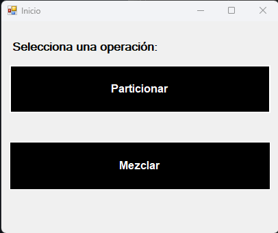
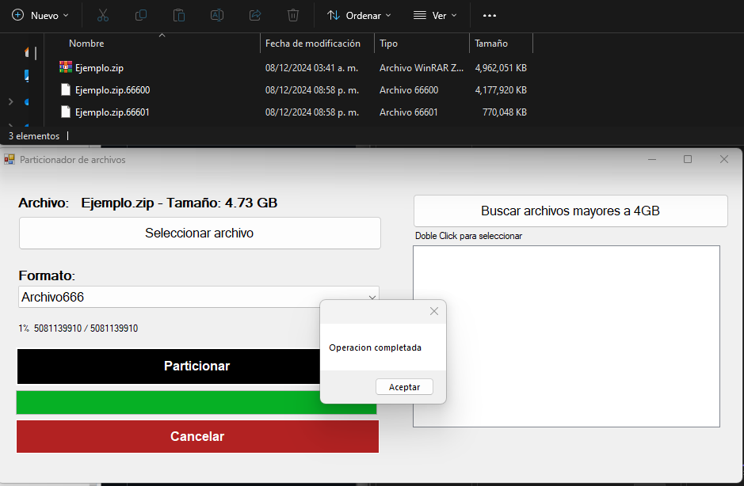
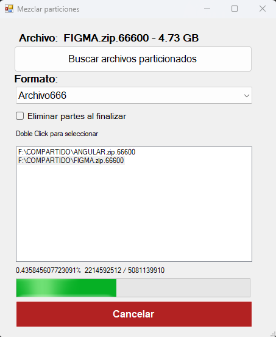

# File-splitter

## Descripción

File-splitter es una aplicación diseñada para dividir archivos grandes en partes más pequeñas, ideal para archivos mayores a 4GB. Permite particionar archivos en una enumeración específica para facilitar su manejo y almacenamiento.

Además, File-splitter incorpora la funcionalidad de recombinar las particiones en un único archivo, restaurando el archivo original previamente particionado.

### Características

- Particiona archivos mayores a 4GB.
- Distintos tipos de enumeración para las particiones.
- Restaura el archivo original mezclando las particiones.
- Realiza la lectura y escritura de manera asíncrona.

## Capturas de pantalla

